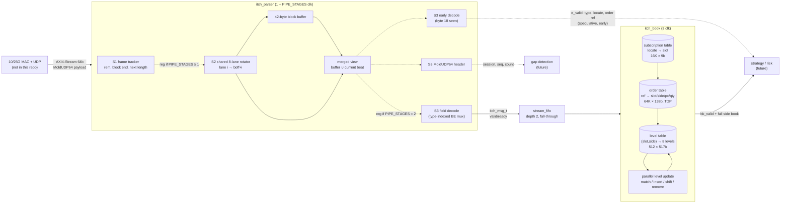

# itch-fpga: low-latency Nasdaq ITCH 5.0 feed handler in SystemVerilog

[](https://github.com/gambrelcolby63/itch5-parser-sv/actions/workflows/ci.yml)

A synthesizable, vendor-neutral SystemVerilog **market-data feed handler** for Nasdaq TotalView-ITCH 5.0
over MoldUDP64. It has two parts:

* **`itch_parser`** takes a 64-bit AXI4-Stream and decodes one message per clock. The result is
  registered **1 + `PIPE_STAGES` cycles** after the message's last byte (1, 2 or 3), with no bubbles
  at line rate. `PIPE_STAGES` trades latency cycles for clock rate (see [Timing](#timing-critical-path-analysis-and-pipelining)).
* **`itch_book`** is an order-level → price-level book for a subscribed set of symbols (default 256
  symbols, 8 levels per side). A full post-update side book comes out **4 + `PIPE_STAGES` cycles**
  after the last byte of the ITCH message.

Everything is verified with cocotb against independent Python golden models, on Verilator and on Icarus.

## At a glance

| | |
|---|---|
| RTL | SystemVerilog, synthesizable subset, no vendor primitives, `verilator -Wall` clean (0 warnings, no waivers) |
| Interface | AXI4-Stream in (`tdata[63:0]`, `tkeep`, `tvalid`, `tready`, `tlast`), book events out |
| Parser latency | **1 + `PIPE_STAGES` clocks** (1, 2 or 3), last byte in → decoded message registered; checked exactly for every message |
| Book latency | **4 + `PIPE_STAGES` clocks**, last byte in → post-update side book registered; checked exactly for every event |
| Throughput | 8 B/clock sustained in every configuration, **0 input stall cycles** in every full-rate test, including a worst-case message-rate stream |
| Parser timing | longest path **22 → 10 / 7 / 7** generic LUT6 levels (`PIPE_STAGES` 0 / 1 / 2). Post-route estimate on Artix-7 xc7a200t-1 with the open-source nextpnr-xilinx: **~60 MHz → 99–120 / 111–127 / 140–163 MHz** (3 placement seeds, not Vivado) |
| Verification | per `make test`: ~42.5k parser messages and 3 book suites in each of the 3 pipeline configs; book events compared bit-exactly with a model; soak over 5 seeds × 3 configs; mutation testing (35 injected bugs, all caught); Verilator + Icarus |
| Reproducible | `make lint`, `make test`, `make synth`, `make pnr`; GitHub Actions runs lint + tests on every push |

## Architecture



### Parser: how messages that straddle beats are handled

The parser has three logical stages. `PIPE_STAGES` puts a register after S1 (1) or after S1 and S2 (2).

* **S1, frame tracker.** This is the only per-beat feedback loop. `rem_q` holds how many bytes of the
  current block (or MoldUDP64 header) are still to come, so "the block ends in this beat, at lane
  `rem_q`" is a lookup of `tkeep` at a registered index. When the next block's 2-byte length arrives, S1
  computes the next `rem_q`, the block offset `boff` and a one-hot "length matches type *i*" vector.
  A length prefix split across beats is kept in `len_hi_q`.
* **S2, assemble.** Every ITCH 5.0 message is at least 12 bytes, so a block is at least 14 bytes, and
  **a beat contains at most one block boundary**: the tail of one block and the head of the next. One
  shared 8-lane rotator steers lane *i* to block offset `boff + i`. The tail merges with the 42-byte
  block buffer into the *merged view*. The head of the next block goes to buffer positions 0..7 in the
  same cycle; it can't collide with the tail positions, because of the minimum length.
* **S3, decode.** Type decode, length check, field extraction from fixed offsets of the merged view,
  the MoldUDP64 header, the early strobe, packet checks, and the registered outputs.

With `PIPE_STAGES=0` the complete message is decoded and registered on the **same edge** that accepts
its last byte. The **MoldUDP64 header** is treated as a fixed 20-byte "block" in the same tracker, so
there's no realignment shifter (see the tradeoffs section).

### Book: pipeline

| Cycle | Stage | Work |
|---|---|---|
| t | parser | beat with the message's last byte accepted; message decoded, registered (with `PIPE_STAGES` = *n*, the later rows shift by *n* cycles) |
| t+1 | accept | message passes the (empty) fall-through FIFO; subscription and order-table reads issued (port A: existing ref, port B: new ref's bucket) |
| t+2 | LOOK | subscribed? order hit? bucket free? compute order-table writes (update/delete/insert) and level ops; level-table read issued |
| t+3 | UPD | parallel level update (step 1: remove qty, step 2: add qty; a Replace does both in one pass on the same word); write back; register event |
| t+4 | out | `bk_valid` with slot, side, count, trunc flag, all 8 (price, qty) levels, msg type, locate, timestamp |

| Message | Order table | Level table |
|---|---|---|
| `A` / `F` | insert (port B); drop on bucket collision | += shares at price |
| `E` / `C` / `X` | shares −= n (saturating); delete at 0 | −= min(n, shares) at the **resting** price (for `C` too, not the execution price) |
| `D` | delete | −= remaining shares |
| `U` | delete original (port A), insert new ref with same slot/side (port B) | −= old @ old price, then += new @ new price |

## Latency and throughput

The testbench measures every latency for every message or event, and it asserts the exact value
for the configuration under test. One cycle = one clock period. The @ 156.25 MHz column is only a unit
conversion at the 10GbE 64-bit clock. The Fmax each configuration actually reaches (as an estimate) is
in [Timing](#timing-critical-path-analysis-and-pipelining).

| Path | `PIPE_STAGES` = 0 / 1 / 2 | @ 156.25 MHz (10GbE 64b) | Measured in `make test` |
|---|---|---|---|
| Last byte in → `m_valid` (parser) | 1 / 2 / 3 cycles | 6.4 / 12.8 / 19.2 ns | exactly `1 + PIPE_STAGES` for all ~42.5k messages per configuration |
| Byte 18 in → `e_valid` (type, locate, order ref) | 1 / 2 / 3 cycles | 6.4 / 12.8 / 19.2 ns | exactly `1 + PIPE_STAGES` for every early strobe |
| Last byte in → `bk_valid` (full side book) | 4 / 5 / 6 cycles | 25.6 / 32.0 / 38.4 ns | exactly `4 + PIPE_STAGES` for every book event |

Under `m_ready` backpressure the whole parser holds, so the testbench counts *advancing* clock edges
between the input and the output. That count is exactly `1 + PIPE_STAGES` in every test, and the raw
cycle count equals it whenever no stall happens in between.

| Throughput | Capability | Evidence |
|---|---|---|
| Parser input | 8 B/clock, back to back (10 Gb/s at 156.25 MHz), every `PIPE_STAGES` | `line_rate`: 8,928 beats, 0 stalls, in each configuration |
| Book | 1 book message per 2 clocks, 1 non-book message per clock | shortest book message block is `D` = 21 B = 2.6 beats > 2 clocks, so the book is never the bottleneck at line rate |
| Parser → book | a 2-entry fall-through FIFO absorbs the 1-message backlog when a 14-byte block lands while the book is busy | `book_adversarial_rate` (35% `S`, back-to-back `D`, unsubscribed, misses): 47,387 beats, **0 stalls**, peak FIFO occupancy 1 |

## Timing: critical path analysis and pipelining

### Before and after

Parser only (`itch_top`, `MOLD_HDR=1`). "Before" is commit `5d9cb2c`, the single-cycle parser as first written.

| Configuration | Latency (clk) | Generic LUT6 levels | Generic LUT6 | FF | UltraScale+ LUT / FF (Yosys) | Post-route Fmax, xc7a200t-1 (nextpnr-xilinx, 3 seeds) | Latency at median Fmax |
|---|---|---|---|---|---|---|---|
| before | 1 | **22** | 2,622 | 1,326 | 5,143 / 1,326 | 59.0 / 60.1 / 60.7 MHz | 16.6 ns |
| `PIPE_STAGES=0` | 1 | **10** | 1,596 | 1,291 | 2,600 / 1,291 | 99.4 / 101.7 / 119.6 MHz | 9.8 ns |
| `PIPE_STAGES=1` | 2 | **7** | 1,612 | 1,395 | 2,084 / 1,395 | 111.3 / 118.0 / 127.4 MHz | 16.9 ns |
| `PIPE_STAGES=2` | 3 | **7** | 1,600 | 1,747 | 2,192 / 1,747 | 139.9 / 159.5 / 162.7 MHz | 18.8 ns |

* **Generic LUT6 levels**: Yosys 0.52 `synth -flatten; abc -lut 6`, then `ltp`, covering every
  register/IO → register/IO path (`make synth`; per-endpoint breakdown via `scripts/depth_report.py`).
  This is a technology-independent proxy: it has no carry chains, and ABC's depth mapping is
  heuristic. The same kind of change moved results by ±1 level between runs.
* **Post-route Fmax** is a real place-and-route, but it is an **open-source estimate, not Vivado
  sign-off**. The flow is Yosys `synth_xilinx -family xc7 -abc9` then nextpnr-xilinx (openXC7,
  prjxray timing database) on an **Artix-7 xc7a200tfbg484-1**, with 3 placement seeds per
  configuration (`make pnr`). The parser sits in `syn/timing_harness.sv`, which feeds its inputs from
  a shift register and XOR-folds all ~940 output bits into one registered pin. That way, every parser
  path is register-to-register and the design fits the package's pins. The harness adds ~75 input
  FFs and a registered 6:1 XOR tree.
* **The seed spread is large** (P0 99→120 MHz): at these depths, routing is 54–77% of the critical-path delay.
  Speed grade is not modelled separately: prjxray has one timing set for the family.
* No UltraScale+ timing is claimed: no open place-and-route flow with timing data for it was
  available here. On UltraScale+
  the absolute numbers would be higher. The ranking should hold, but that is not measured.

### What limited the single-cycle parser

Probing internal nets of the original design on the generic LUT6 map (arrival depth in LUT levels):

| Signal | Depth | Why |
|---|---|---|
| byte count `nb` (priority-encode `tkeep`) | 2 | |
| current length (mux of buffer byte / lane bytes by `boff`) | 4 | length is re-selected from the byte lanes every beat |
| block total `len + 2` | 8 | 16-bit add after the mux |
| bytes remaining `total − boff` | 10 | 17-bit subtract after the add |
| `cur_ends` (`remaining ≤ nb`) | 11 | compare after the subtract |
| `boff_q` next state | 13 | **the per-beat recurrence**: everything above is inside it |
| lane steering, message type | 14 | steering waits for `cur_ends` |
| `emit` (type decode → spec-length mux → 16-bit compare) | 17 | |
| 32-bit statistics counters | **22** | counter add chained after `emit`, ripple-carried in a generic map |

The root cause was structural. Every beat rebuilt "bytes remaining" from a length muxed out of the
buffer or lanes (add, then subtract, then compare). Lane steering, type decode, the length check,
`emit` and the counters were all chained behind that. On the real part, the baseline critical path
started at `boff_q` and spent 7.1–7.6 ns in logic plus 9.1–9.5 ns in routing.

### What was restructured

1. **Carry the remaining-byte count as state (`rem_q`).** The block end is known from a register, not
   recomputed from the length every beat. Length arithmetic happens only when a new length arrives,
   and it only feeds next-state registers.
2. **Read `tkeep` as a thermometer code.** `tkeep` is contiguous by contract, so "at least *n* bytes"
   is `tkeep[n-1]`. Block-ends-here, next-block-present, and whether the next length is complete are
   each one `tkeep` bit selected by a registered index, instead of encode → subtract → compare. The
   binary byte count only feeds the tracker's own arithmetic.
3. **Split subtraction** (`sub_small`). `x − nb` computes the low nibble and uses its borrow to pick
   between `x_hi` and `x_hi − 1`. Both of those depend only on registers or tdata, so the wide part
   runs in parallel with the `tkeep` decode.
4. **Precomputed comparisons.** "Length < 7" is evaluated for all 8 lane positions straight from
   tdata, and the tracker only selects one flag. The spec-length check is a one-hot "length == spec
   length of type *i*" vector computed in S1 as soon as the length is known, so S3 does
   `|(type_onehot & len_hit)` instead of type decode → length mux → 16-bit compare.
5. **One shared 8-lane rotator** in S2 replaces the per-buffer-byte 8:1 lane muxes. Together with
   item 1, this is where total generic LUTs fell from 2,622 to ~1,600.
6. **Message-count check as a down-counter** (`blk_left_q`, loaded from the header, compared with
   0/1), replacing increment → mux → 16-bit compare at `tlast`.
7. **Statistics counters off the path.** Event pulses are registered, and each counter is a
   `stat_counter`: 8-bit segments with registered "segment is all ones" flags. The count is exact
   every cycle, and the carry into a segment is an AND of at most 3 flags plus the increment (3
   generic levels for 32 bits, against 7 for a ripple adder). Counters update one cycle after the output they count.
8. **Output registers without the decision in their enable.** `m_msg` loads whenever the output
   register is free; it is don't-care while `m_valid` is low. `e_*` and `hdr` load every cycle and are
   qualified by their valid. The deep `emit` decision then drives only `m_valid`, not ~460 clock
   enables (this was a routed high-fanout path in an intermediate version).
9. **Optional pipeline registers** (`PIPE_STAGES`) between S1/S2 and S2/S3, all on the same advance
   enable, so throughput stays one beat per clock and backpressure stays lossless.

What limits each configuration now (generic map, `syn/out/depth_p*.txt`; post-route critical paths
from nextpnr):

* `PIPE_STAGES=0`: the full `tkeep` → tracker → rotator → decode → `m_valid`/output cone (10 levels).
  Post-route it starts at `rem_q`.
* `PIPE_STAGES=1`: S2 + S3 (rotator → decode → outputs, 7 levels) and the S1 recurrence, about equal.
* `PIPE_STAGES=2`: S1 is the limiter: `tkeep` → next `rem_q`/`boff`/`drop` (7 levels). Post-route,
  2 of 3 seeds end at `rem_d` from the input register. The third ends in a statistics-counter carry
  (`evt_q` → `seg_en`) at 6.1 ns.

### The tradeoff

* **Lowest latency in ns: `PIPE_STAGES=0`.** One cycle at ~100–120 MHz is ~8–10 ns, better than the
  original design in both cycles *and* clock rate. It does not reach 156.25 MHz on this part in these
  runs.
* **Highest clock: `PIPE_STAGES=2`.** It reached 159.5 and 162.7 MHz in 2 of 3 seeds, and 139.9 MHz
  in the third. Its latency is ~19 ns at those clocks. It is the only configuration that can run at
  the 156.25 MHz clock of a 64-bit 10GbE MAC on an Artix-7 -1 (on these estimates, not signed off).
* **`PIPE_STAGES=1`** splits the difference and shows the balance: its two stages are about equally
  deep.
* In a real system the MAC fixes the clock. At that fixed clock, fewer stages mean fewer ns if timing
  closes. So the recipe is: use the smallest `PIPE_STAGES` that closes at the MAC clock on the target
  part. On a faster family (UltraScale+), that is likely a lower setting than on Artix-7, but that is
  not measured here.
* **Default: `PIPE_STAGES=0`** (on `itch_top`; `PARSER_PIPE` on `itch_feed_top`). It keeps the
  original 1-cycle interface timing. On an Artix-7 -1 at the 10GbE clock, use 2.
* Area barely moves: `PIPE_STAGES=2` costs ~450 extra FFs (the 42-byte merged view is registered)
  and no extra LUTs.
* The next steps for timing, in order:
  * a skid buffer at the output, to cut the `m_ready` → `tready` path and the advance-enable fanout;
  * an input register with the `tkeep` decode precomputed, which would take S1 below 7 levels;
  * a Vivado run on the actual target part.

## Book defaults and why

| Parameter | Default | Reasoning |
|---|---|---|
| `LEVELS` | **8** | Covers what near-touch HFT signals typically use (top-of-book, imbalance, microprice, depth near the touch). A side-book word is 8 × (32b px + 32b qty) + count + flag = 517 bits, so it fits one 576-bit row of 8 parallel 72-bit BRAM36s. The insert/shift network grows linearly with depth. Measured in the synthetic test market: 4 levels → 71.4% full-depth agreement with an unbounded book; 8 → 99.2%; 16 → 100%, at 2× the word width and update logic. |
| `NUM_SYMBOLS` | **256** | A realistic strategy universe (e.g. an ETF plus its constituents). 256 × 2 sides = 512 rows, exactly the depth of a BRAM36 in 72-bit mode, so no BRAM is wasted. |
| `ORD_BITS` | **16** (64K orders) | Holds only *subscribed* symbols' live orders. An entry is 138 bits (valid, 64b ref, slot, side, price, shares). Yosys maps it to BRAM36; a production build would target URAM (see limits). Tests use 12 (4K entries) to force collisions. |
| `LOCATE_BITS` | **14** (16K) | Stock Locate is a 16-bit field, but codes are assigned per day for the securities in the Stock Directory, on the order of 10⁴ symbols. 16K × 9 b costs about 4 BRAM36. Out-of-range locates are **rejected, never aliased**; a directed test and a mutant cover this. |
| `MSG_FIFO_DEPTH` | **2** | Peak backlog is 1 message (a small message arriving during a 2-cycle book update). Depth 2 lets a push and a pop happen in the same cycle without stalling. Measured peak occupancy is 1 in every test. |

## Design tradeoffs

| Decision | Alternative | Why this way |
|---|---|---|
| **Merged-view decode**: decode on the edge that accepts the last byte | Realign each message to lane 0, then decode from fixed offsets | Saves a pipeline stage and gives 1-cycle latency at `PIPE_STAGES=0`. The cost is a wider mux (each buffer byte picks from 8 lanes or the stored byte). |
| **`PIPE_STAGES` parameter** (0/1/2) instead of one fixed pipeline | Pick one depth | The right point depends on the clock the MAC imposes and on the part. Keeping all three, with the same tests, makes the latency/Fmax tradeoff measurable instead of argued. |
| **Stall-all pipeline** (one advance enable, `tready = !m_valid \|\| m_ready`) | Per-stage valid/ready with skid buffers | Simple and provably lossless, and at `m_ready = 1` (the book always accepts) it never stalls. Cost: `m_ready` → `tready` is combinational, and the enable fans out to every pipeline register. A skid buffer at the output would cut both. |
| **MoldUDP64 header as a 20-byte pseudo-block** | Header stripper with a byte shifter + residual register | A shifter holds bytes in lanes 4–7 until the *next* beat arrives, which is an unbounded wait if the link idles. Here the first block just starts at lane 4, at no cost. |
| **Registered outputs** | Combinational (0-cycle) output | Registered outputs give clean timing boundaries between blocks. The early strobe claws back latency where it matters (order-ref lookups). |
| **Speculative early strobe** | Only announce complete messages | For an Add Order, the order ref is known 2–3 beats before the message completes. A downstream table can start its lookup early. It must commit only on `m_valid` (truncation is possible, and the testbench models it). |
| **Book as a 2-cycle FSM** (accept → LOOK → UPD) | Fully pipelined, 1 message per clock with forwarding | No read-after-write hazards by construction, so the logic stays simple and easy to verify. It's sufficient because book messages are at least 21 B apart on the wire. At 25G+ or with multiple feeds this becomes a pipelined design with hazard forwarding. |
| **Wide-word level table**, parallel compare/insert/shift | Per-level RAMs, a heap, or a full-depth book in DRAM | One read-modify-write per update, and O(1) cycles regardless of where the level lands. Cost: bounded depth, handled explicitly with a sticky `trunc` flag. |
| **Direct-mapped order hash** on low ref bits | Set-associative, cuckoo, or DRAM/HBM-backed table | Simplest correct structure, with deterministic behaviour that the model mirrors exactly. Collisions are *detected*, counted and never corrupt other orders. The real limit is documented below with numbers. |
| **Invariant: a level only holds quantity from orders in the order table** | Add quantity even when the order can't be stored | An untracked order could never be removed, so its level would be inflated forever. Dropping it keeps errors bounded and observable. |
| **Normalized `itch_msg_t`** (one struct, zeros for fields that don't apply) | A tagged union / one struct per type | One output bus and one scoreboard, and downstream logic doesn't need a type decoder. It costs some wires. |
| **Clear sweep after reset** for all tables | Rely on FPGA configuration zeroing BRAM | A start-of-day reset works without reconfiguration. `init_done` gates input. |

## Verification

The golden models are written independently of the RTL, straight from the spec tables:

* `tb/itch_model.py` builds byte-exact ITCH messages from a field table, decodes them back, frames
  them as MoldUDP64, and packs AXI-Stream beats (optionally with random partial beats).
* `tb/book_model.py` has three parts:
  * `BookModel`, a bit-exact mirror of the book semantics (hash collisions, depth truncation, the
    `trunc` flag);
  * `IdealBook`, an unbounded book used to *measure* the effect of the hardware limits;
  * `Market`, a self-consistent synthetic order flow: executes, cancels, deletes and replaces only
    reference live orders, and prices cluster near a mid so levels overlap and depth overflows.

Each test runs a single cycle-accurate coroutine. It drives random `tvalid` gaps with junk on the idle
bus and random `m_ready` backpressure, and it checks every output field, every counter, and the latency
of every message. `make test` runs every parser and book suite in all three `PIPE_STAGES`
configurations.

| Suite | Test | Covers |
|---|---|---|
| parser | `directed_straddle` | each of the 8 types starting at **every lane 0–7** (length prefix and every field straddling beats in every way), plus all 15 undecoded ITCH types |
| parser | `line_rate` | no gaps; asserts 1 beat/clock |
| parser | `random_backpressure` | 20k messages over 4 `(p_valid, p_ready)` corners |
| parser | `partial_beats` | beats carrying 1–8 bytes anywhere in a frame, and empty (`tkeep = 0`) `tlast` beats |
| parser | `errors_and_recovery` | wrong length, short length, truncation, Mold count mismatch, end-of-session and heartbeat (with and without an empty `tlast` beat, and with blocks after them), resync |
| unit | `stat_counter` | the segmented statistics counter at small widths (W/SEG = 10/2, 9/3, 8/4) through 11–48 wrap-arounds with a mid-run reset, compared every cycle |
| book | `book_directed` | hand-computed scenarios: level ordering, joins, partial/full execution, `C` uses the resting price, replace into the same bucket, replace/insert collisions, unsubscribed and out-of-range locates, depth overflow and drain with `trunc` |
| book | `book_random` | 30k-message self-consistent flow over 48 symbols (32 subscribed) with gaps; every event compared bit-exactly against `BookModel`, plus agreement against `IdealBook` |
| book | `book_line_rate` | full rate, asserts 0 stalls |
| book | `book_adversarial_rate` | worst-case message rate, asserts 0 stalls |

**Results** (`make test`, seed 20260927, Verilator 5.052):

```
PIPE_STAGES      0                    1                    2
parser Mold      6/6  21,525 msgs     6/6  21,546 msgs     6/6  21,551 msgs     latency exactly 1 / 2 / 3
parser raw       6/6  20,990 msgs     6/6  20,994 msgs     6/6  20,991 msgs     latency exactly 1 / 2 / 3
parser+book      5/5                  5/5                  5/5                  latency exactly 4 / 5 / 6
                 book_random: 28,494 msgs -> 18,207 book events (bit-exact) in each configuration
                 book_line_rate / book_adversarial_rate (47,387 beats): 0 input stalls in each configuration
stat_counter     W=10/SEG=2: 11 wraps, W=9/SEG=3: 23 wraps, W=8/SEG=4: 48 wraps, exact every cycle
```

(The message counts differ slightly between configurations because the random `tvalid`/`m_ready`
draws interleave differently with the pipeline.)

**Soak** (`make soak`, seeds 1–5, in each of `PIPE_STAGES` 0 / 1 / 2):

```
parser  per configuration: 10 runs (5 seeds x Mold/raw), 60/60 tests pass, ~851k messages
        (850,951 / 850,965 / 850,861), latency always exactly 1 / 2 / 3; 2.55M messages in total
book    per configuration: 5 runs (5 seeds, 200k each), 25/25 tests pass, 1,731,264 messages
        through parser->book; book_random: 949,734 msgs -> 604,944 events, all bit-exact vs
        BookModel, latency exactly 4 / 5 / 6, 0 input stalls, peak FIFO occupancy 1
```

**How close is the bounded hardware book to the true book?** This is measured on the `book_random`
flow (30k messages, 32 subscribed symbols, about 600 live orders), comparing each hardware event
against `IdealBook`:

| Order table | Levels | Insert collisions | Top-of-book agreement | Full-depth agreement |
|---|---|---|---|---|
| 4K (`ORD_BITS=12`) | 8 | 242 | 91.67% | 76.91% |
| 16K (`ORD_BITS=14`) | 8 | 0 | 100.00% | 99.22% |
| 64K (`ORD_BITS=16`, default) | 8 | 0 | 100.00% | 99.22% |
| 64K | 4 | 0 | 99.94% | 71.38% |
| 64K | 16 | 0 | 100.00% | 100.00% |

In every configuration the RTL matched `BookModel` bit-exactly. The agreement column measures the
*design's* limits, not bugs. It shows that order-table collisions are the dominant error source, while
depth truncation almost never reaches top-of-book.

**Mutation testing** (`make mutation`) injects 35 realistic bugs:
* 22 in the parser. Each runs in `PIPE_STAGES` 0 and 2, and counts as caught only if both fail.
  Pipeline-register mutants run in the configurations where that register exists.
* 3 in the statistics counter.
* 10 in the book/FIFO.

Examples: wrong field offsets, a swapped bit in the one-hot length check, a thermometer index off by
one, a dropped borrow in the split subtraction, the next-block head rotated one lane off, the block
buffer written on idle cycles, a pipeline register or `m_msg` that loads while stalled, events not
gated by the advance enable, the message-count check off by one, a counter segment flag set one count
late, asks sorted like bids, a fully executed order not deleted, `C` using the execution price, and a
FIFO bypass that ignores ready. **All 35 are caught.** One mutant ("S3 events not gated by the
advance enable") is equivalent at `PIPE_STAGES=0`, where the stage-3 valid already includes the
enable, so it runs in 1 and 2. Another (the end-of-session flag not cleared) survived at first. It
exposed a real gap: nothing tested an empty (`tkeep = 0`) `tlast` beat. Empty `tlast` beats are now
generated in `partial_beats` and in directed count-check cases.

The same regressions pass on **Icarus Verilog 12** (`make test-icarus`, at reduced size for speed):
* parser 6/6 in every `PIPE_STAGES` (about 7k messages each, plus raw mode at `PIPE_STAGES=2`);
* book 5/5 with exact latency 4 / 5 / 6;
* the counter unit test.

That gives a two-simulator cross-check. It also caught simulator-portability problems that Verilator
accepted: Icarus rejects variable selects of packed-struct members, and it produced X for one
lane-pair comparison. The RTL now avoids both constructs.

## Static analysis

`make lint` runs `verilator --lint-only -Wall` on 16 configurations:
* the parser top in every `PIPE_STAGES` × `MOLD_HDR` combination;
* the feed top with `PARSER_PIPE` 0/1/2, plus a small feed config (`LEVELS=4 NUM_SYMBOLS=64
  ORD_BITS=12 MSG_FIFO_DEPTH=4`);
* `stat_counter` at four widths;
* the timing harness.

The result is **0 warnings**, and there are no `lint_off` pragmas in the RTL.

## Synthesis (Yosys estimates, not vendor place-and-route)

`make synth` converts the RTL with sv2v (Yosys's own SV frontend doesn't accept package imports in
the module header). It maps the parser in each `PIPE_STAGES` both to generic LUT6 (depth, see
[Timing](#timing-critical-path-analysis-and-pipelining)) and with Yosys 0.52
`synth_xilinx -family xcup` (UltraScale+), without IO buffers.

| Design (Yosys 0.52 `synth_xilinx -family xcup`) | LUT | FF | RAMB36 | RAMB18 | LUTRAM | MUXF7/8/9 | CARRY |
|---|---|---|---|---|---|---|---|
| `itch_top` (parser only), `PIPE_STAGES=0` | 2,600 | 1,291 | 0 | 0 | 0 | 495/229/69 | 56 |
| `itch_top` (parser only), `PIPE_STAGES=1` | 2,084 | 1,395 | 0 | 0 | 0 | 154/69/11 | 56 |
| `itch_top` (parser only), `PIPE_STAGES=2` | 2,192 | 1,747 | 0 | 0 | 0 | 414/114/1 | 56 |
| `itch_feed_top` (parser + FIFO + book, defaults) | 8,253 | 2,130 | 260 | 15 | 23 | 1637/565/205 | 212 |

Before the timing work, the parser was 5,143 LUT / 1,326 FF and the feed top 10,328 LUT / 2,109 FF.

**Where the book's logic goes** (feed top, other parameters at their defaults; book + FIFO = feed − parser):

| Variant | Feed LUT | Book + FIFO LUT | FF | RAMB36 / RAMB18 |
|---|---|---|---|---|
| `LEVELS=4` | 5,861 | ~3.3k | 1,873 | 264 / 0 |
| `LEVELS=8` (default) | 8,253 | ~5.7k | 2,130 | 260 / 15 |
| `LEVELS=16` | 13,532 | ~10.9k | 2,643 | 260 / 29 |
| `ORD_BITS=12` (4K orders) | 7,016 | ~4.4k | 2,116 | 20 / 15 |

(Book + FIFO is approximate: with `-flatten`, logic optimizes across the parser boundary. The
`ORD_BITS=12` LUT delta was ~170 with the previous parser and ~1.2k now, so treat LUT differences
of that size as synthesis noise.)

* Book logic grows **linearly with depth, about 640 LUTs per level**. That is the parallel
  compare/insert/shift network, which is what `LEVELS` really costs.
* Shrinking the order table 16× saves 240 RAMB36. Its 64K × 138b (about 9 Mb) belongs in URAM on
  UltraScale+.
* An RTL-style lesson: the first version indexed packed-struct members with loop variables
  (`book.lv[i].price`). That was 16,352 LUTs for the same function, and Icarus couldn't compile it.
  Rewriting the level network on plain unpacked `px[]`/`qty[]` arrays gave bit-identical
  simulation results (every regression, and every mutant re-killed) at 37% fewer LUTs.

**Timing (honest).**

* The parser numbers are in [Timing](#timing-critical-path-analysis-and-pipelining). They are generic
  depth plus open-source place-and-route estimates on Artix-7, not Vivado.
* The book has not been through place-and-route. Its cones are the order-table read → level-table
  address path (block RAM clock-to-out feeding an address), and the 8-level compare/insert network on
  a 517-bit word.
* Verification is at RTL level. The Yosys netlist has not been simulated or equivalence-checked.

## Reproduce

```bash
./scripts/setup.sh    # apt deps, Verilator 5.052 from source (cocotb 2.x needs >= 5.036), sv2v, .venv
make lint             # Verilator -Wall, 16 configurations
make test             # parser (Mold + raw), parser+book, in PIPE_STAGES 0/1/2; stat_counter
make test-icarus      # same on Icarus Verilog (reduced size)
make synth            # Yosys: generic LUT6 depth per PIPE_STAGES, UltraScale+ maps -> syn/out/summary.md
make soak             # 5 seeds x PIPE_STAGES 0/1/2: parser 100k x 2 modes + book 200k
make mutation         # 35 injected bugs must all be caught (runs in parallel, ~3 min on 8 cores)
python tb/run.py --top parser --pipe 2 --mold 0 --msgs 50000              # any configuration
python tb/run.py --top feed --pipe 1 --levels 16 --ord-bits 16 --book-msgs 50000

# optional: open-source place-and-route timing estimate on Artix-7 (not in CI)
./scripts/setup_openxc7.sh   # prebuilt openXC7 (nextpnr-xilinx) + xc7a200t chipdb, pinned SHA-256
make pnr                     # PIPE_STAGES 0/1/2 x seeds 1-3 -> syn/out/pnr_p*/
# the "before" row: git worktree add /tmp/base 5d9cb2c && scripts/pnr_xc7.sh --baseline /tmp/base/rtl
```

CI (`.github/workflows/ci.yml`) runs on push or PR on `ubuntu-24.04`. It builds Verilator 5.052 from
source once and caches it, installs a pinned cocotb (`requirements.txt`), then runs `make lint`,
`make test` and `make test-icarus` (all `PIPE_STAGES` configurations), and uploads the logs.

## Repository layout

```
rtl/itch_pkg.sv          ITCH constants, spec lengths, one-hot type/length helpers, itch_msg_t, mold_hdr_t
rtl/itch_parser.sv       MoldUDP64 + ITCH 5.0 parser (PIPE_STAGES 0/1/2)
rtl/stat_counter.sv      statistics counter with registered segment carries
rtl/stream_fifo.sv       fall-through valid/ready FIFO
rtl/itch_book.sv         subscription table, order table, price-level book
rtl/itch_top.sv          parser-only flat-port top
rtl/itch_feed_top.sv     parser -> FIFO -> book top
tb/itch_model.py         ITCH/MoldUDP64 golden model and AXI-Stream packing
tb/book_model.py         bit-exact book model, unbounded ideal book, market generator
tb/test_itch.py          parser tests          tb/test_book.py   book tests
tb/test_stat_counter.py  stat_counter unit test
tb/run.py                cocotb runner (Verilator/Icarus, any parameters)
scripts/                 setup, mutation testing, synthesis report, LUT-depth report
                         (depth_report.py), openXC7 setup and place-and-route (pnr_xc7.sh)
syn/                     Yosys scripts, timing_harness.sv (register-bounded wrapper for PnR)
.github/workflows/ci.yml GitHub Actions
```

## Honest limits

* **Order table is direct-mapped.** The chance that an insert collides is about the table's
  occupancy (live subscribed orders ÷ entries). The test flow keeps about 600 live orders, so 64K
  entries give zero collisions. A liquid real-world universe can have tens of thousands of live
  orders per symbol set, which would make a direct-mapped 64K table lossy. Production needs a 4–8 way
  set-associative or cuckoo table, sized for peak live orders, in URAM/HBM.
* **Bounded depth.** Once a side drops a level, its `trunc` flag stays set. Deeper levels may then
  be missing, and a level that re-forms at a dropped price can be under-counted. Top-of-book is
  still right in 99.9%+ of events in the measurements above.
* **No sequence-gap handling.** MoldUDP64 session/sequence are parsed and reported, but not yet
  checked, so a lost packet silently corrupts the book. Gap detection and a snapshot/retransmit path
  come next.
* **Timing not closed in a vendor tool.** Fmax numbers are nextpnr-xilinx estimates on Artix-7
  with a one-speed-grade timing model, and the resource numbers are Yosys estimates. Vivado will
  differ, and no UltraScale+ timing exists yet. The order table should be URAM, but Yosys inferred
  BRAM36.
* **Stall-all flow control.** One advance enable drives every parser pipeline register, and
  `m_ready` → `s_axis_tready` is combinational. Neither matters when the consumer always accepts (the
  book does), but a skid buffer would be needed for a consumer with long ready paths.
* **Parser input.** `tkeep` must be contiguous from lane 0. Partial beats anywhere, and empty `tlast`
  beats, are fine and tested. The parser reads `tkeep` as a thermometer code, so a non-contiguous
  `tkeep` is **not detected**: framing is wrong until the next `tlast` resynchronizes. Messages shorter than 7 bytes are treated as framing errors (the shortest ITCH message is
  12). A block may not span packets, as MoldUDP64 requires.
* **Book scope.** `U` keeps the original side and slot, as the spec requires. Cross/auction (`Q`,
  `NOII`), trade (`P`), broken trade (`B`) and trading-state messages don't affect the book. Prices
  are raw Price(4) integers. Subscriptions must be written before traffic.
* **Synthetic flow only.** The market generator is self-consistent, but it isn't a replay of real
  Nasdaq data (see next steps).
* **CI** runs `make ci` on GitHub's `ubuntu-24.04` runners (badge above). Place-and-route is not in
  CI; it needs the openXC7 download (~100 MB) and took about 70 s per configuration (3 seeds) here.

## Next steps

1. **Timing closure** on a real part (Alveo U55C / VU9P): an OOC Vivado run with real Fmax and
   utilization for each `PIPE_STAGES`. Add an output skid buffer and an input register with a
   precomputed `tkeep` decode in the parser. Pipeline the book's level update (compare stage → shift
   stage) and put the book through place-and-route.
2. **Set-associative order table in URAM**, prefetched by the early strobe (the order ref is known
   2–3 beats early).
3. **MoldUDP64 session layer**: sequence tracking, gap detection, A/B feed arbitration, and
   snapshot/recovery hooks.
4. **Ethernet/IP/UDP front end** with a multicast filter and 10/25G MAC integration.
5. **Formal**: SymbiYosys properties (no message lost or duplicated, level sort invariant, `count`
   matches non-zero levels, AXI-Stream compliance), plus functional coverage.
6. **Replay real data**: the Nasdaq ITCH sample files through both the model and the DUT, and report
   book agreement and per-message latency on a real day.

## Spec sources

* **Nasdaq TotalView-ITCH 5.0**
  <https://www.nasdaqtrader.com/content/technicalsupport/specifications/dataproducts/NQTVITCHspecification.pdf>
  (PDF dated 2024-02-28).
  * Data types: big-endian unsigned integers, space-padded alpha fields, Price(4) with max
    `0x77359400`, ns-since-midnight timestamps.
  * Offsets for S (§1.1), A/F (§1.3), E/C/X/D/U (§1.4.1–1.4.5).
  * Lengths of every other message type, used to test skipping.
  * The replace and modify semantics the book implements: effects are cumulative, and a replace
    keeps the side, symbol and attribution.
* **MoldUDP64**
  <https://www.nasdaqtrader.com/content/technicalsupport/specifications/dataproducts/moldudp64.pdf>.
  * Header: Session(10) @0, Sequence(8) @10, Count(2) @18.
  * Block: a 2-byte big-endian length (not counting itself), then the data.
  * Count 0 is a heartbeat, and 0xFFFF is end of session.
