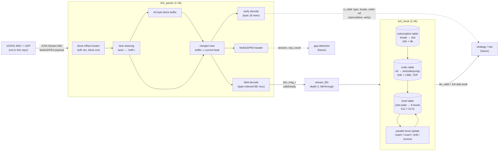

# itch-fpga: low-latency Nasdaq ITCH 5.0 feed handler in SystemVerilog

<!-- After pushing to GitHub, add:  -->

A synthesizable, vendor-neutral SystemVerilog **market-data feed handler** for Nasdaq TotalView-ITCH 5.0
over MoldUDP64. It has two parts:

* **`itch_parser`** takes a 64-bit AXI4-Stream and decodes one message per clock. The result is
  registered **1 cycle** after the message's last byte, with no bubbles at line rate.
* **`itch_book`** is an order-level → price-level book for a subscribed set of symbols (default 256
  symbols, 8 levels per side). A full post-update side book comes out **4 cycles** after the last
  byte of the ITCH message.

Everything is verified with cocotb against independent Python golden models, on Verilator and on Icarus.

## At a glance

| | |
|---|---|
| RTL | SystemVerilog, synthesizable subset, no vendor primitives, `verilator -Wall` clean (0 warnings, no waivers) |
| Interface | AXI4-Stream in (`tdata[63:0]`, `tkeep`, `tvalid`, `tready`, `tlast`), book events out |
| Parser latency | **1 clock**, last byte in → decoded message registered (measured for every message) |
| Book latency | **4 clocks**, last byte in → post-update side book registered (measured for every event) |
| Throughput | 8 B/clock sustained, **0 input stall cycles** in every full-rate test, including a worst-case message-rate stream |
| Verification | parser: 42k messages per `make test` plus an 849k-message soak; book: 4 tests with exact per-event comparison; mutation testing (20 injected bugs, all caught) |
| Reproducible | `make lint`, `make test`, `make synth`; GitHub Actions workflow for lint + tests |

## Architecture



### Parser: how messages that straddle beats are handled

`boff_q` holds the position of lane 0 of the incoming beat inside the current MoldUDP64 message block
(the 2 length bytes are offsets 0 and 1). Each valid lane is steered to buffer position `boff_q + lane`.
Every ITCH 5.0 message is at least 12 bytes, so a block is at least 14 bytes, and **a beat contains at
most one block boundary**: the tail of one block and the head of the next.

* The tail is merged combinationally with the buffer. The complete message is decoded and registered
  on the **same edge** that accepts its last byte.
* The head of the next block goes to buffer positions 0..7 in the same cycle. It can't collide with
  the tail positions, because of the minimum length.
* A length prefix split across beats is reassembled from `buf_q[0]` and lane 0.
* The **MoldUDP64 header** is treated as a fixed 20-byte "block" in the same tracker, so there's no
  realignment shifter (see the tradeoffs section).

### Book: pipeline

| Cycle | Stage | Work |
|---|---|---|
| t | parser | beat with the message's last byte accepted; message decoded, registered |
| t+1 | accept | message passes the (empty) fall-through FIFO; subscription and order-table reads issued (port A: existing ref, port B: new ref's bucket) |
| t+2 | LOOK | subscribed? order hit? bucket free? compute order-table writes (update/delete/insert) and level ops; level-table read issued |
| t+3 | UPD | parallel level update (step 1: remove qty, step 2: add qty; a Replace does both in one pass on the same word); write back; register event |
| t+4 | out | `bk_valid` with slot, side, count, trunc flag, all 8 (price, qty) levels, msg type, locate, timestamp |

| Message | Order table | Level table |
|---|---|---|
| `A` / `F` | insert (port B); drop on bucket collision | += shares at price |
| `E` / `C` / `X` | shares −= n (saturating); delete at 0 | −= min(n, shares) at the **resting** price (for `C` too, not the execution price) |
| `D` | delete | −= remaining shares |
| `U` | delete original (port A), insert new ref with same slot/side (port B) | −= old @ old price, then += new @ new price |

## Latency and throughput

All latencies are measured by the testbench for every message or event, not estimated. One cycle =
one clock period. The ns columns only convert units: **no Fmax is claimed** (see Synthesis).

| Path | Cycles | @ 156.25 MHz (10GbE 64b) | @ 250 MHz | Measured histogram |
|---|---|---|---|---|
| Last byte in → `m_valid` (parser) | 1 | 6.4 ns | 4.0 ns | `{1: 42115}` in `make test` |
| Byte 18 in → `e_valid` (type, locate, order ref) | 1 | 6.4 ns | 4.0 ns | `{1: all}` |
| Last byte in → `bk_valid` (full side book) | 4 | 25.6 ns | 16.0 ns | `{4: all}` in every book test |

| Throughput | Capability | Evidence |
|---|---|---|
| Parser input | 8 B/clock, back to back (10 Gb/s at 156.25 MHz) | `line_rate`: 8,928 beats in 8,937 cycles, 0 stalls |
| Book | 1 book message per 2 clocks, 1 non-book message per clock | shortest book message block is `D` = 21 B = 2.6 beats > 2 clocks, so the book is never the bottleneck at line rate |
| Parser → book | a 2-entry fall-through FIFO absorbs the 1-message backlog when a 14-byte block lands while the book is busy | `book_adversarial_rate` (35% `S`, back-to-back `D`, unsubscribed, misses): 47,387 beats, **0 stalls**, peak FIFO occupancy 1 |

## Book defaults and why

| Parameter | Default | Reasoning |
|---|---|---|
| `LEVELS` | **8** | Covers what near-touch HFT signals typically use (top-of-book, imbalance, microprice, depth near the touch). A side-book word is 8 × (32b px + 32b qty) + count + flag = 517 bits, so it fits one 576-bit row of 8 parallel 72-bit BRAM36s. The insert/shift network grows linearly with depth. Measured in the synthetic test market: 4 levels → 71.4% full-depth agreement with an unbounded book; 8 → 99.2%; 16 → 100%, at 2× the word width and update logic. |
| `NUM_SYMBOLS` | **256** | A realistic strategy universe (e.g. an ETF plus its constituents). 256 × 2 sides = 512 rows, exactly the depth of a BRAM36 in 72-bit mode, so no BRAM is wasted. |
| `ORD_BITS` | **16** (64K orders) | Holds only *subscribed* symbols' live orders. An entry is 138 bits (valid, 64b ref, slot, side, price, shares). Yosys maps it to BRAM36; a production build would target URAM (see limits). Tests use 12 (4K entries) to force collisions. |
| `LOCATE_BITS` | **14** (16K) | Stock Locate is a 16-bit field, but codes are assigned per day for the securities in the Stock Directory, on the order of 10⁴ symbols. 16K × 9 b costs about 4 BRAM36. Out-of-range locates are **rejected, never aliased**; a directed test and a mutant cover this. |
| `MSG_FIFO_DEPTH` | **2** | Peak backlog is 1 message (a small message arriving during a 2-cycle book update). Depth 2 lets a push and a pop happen in the same cycle without stalling. Measured peak occupancy is 1 in every test. |

## Design tradeoffs

| Decision | Alternative | Why this way |
|---|---|---|
| **Merged-view decode**: decode on the edge that accepts the last byte | Realign each message to lane 0, then decode from fixed offsets | Saves a pipeline stage and gives 1-cycle latency. The cost is a wider mux (each buffer byte picks from 8 lanes or the stored byte) and a deeper cone from `boff_q`. Latency first, timing second is the right order for a first slice; the timing plan is below. |
| **MoldUDP64 header as a 20-byte pseudo-block** | Header stripper with a byte shifter + residual register | A shifter holds bytes in lanes 4–7 until the *next* beat arrives, which is an unbounded wait if the link idles. Here the first block just starts at lane 4, at no cost. |
| **Registered outputs** | Combinational (0-cycle) output | Registered outputs give clean timing boundaries between blocks. The early strobe claws back latency where it matters (order-ref lookups). |
| **Speculative early strobe** | Only announce complete messages | For an Add Order, the order ref is known 2–3 beats before the message completes. A downstream table can start its lookup early. It must commit only on `m_valid` (truncation is possible, and the testbench models it). |
| **Book as a 2-cycle FSM** (accept → LOOK → UPD) | Fully pipelined, 1 message per clock with forwarding | No read-after-write hazards by construction, so the logic stays simple and easy to verify. It's sufficient because book messages are at least 21 B apart on the wire. At 25G+ or with multiple feeds this becomes a pipelined design with hazard forwarding. |
| **Wide-word level table**, parallel compare/insert/shift | Per-level RAMs, a heap, or a full-depth book in DRAM | One read-modify-write per update, and O(1) cycles regardless of where the level lands. Cost: bounded depth, handled explicitly with a sticky `trunc` flag. |
| **Direct-mapped order hash** on low ref bits | Set-associative, cuckoo, or DRAM/HBM-backed table | Simplest correct structure, with deterministic behaviour that the model mirrors exactly. Collisions are *detected*, counted and never corrupt other orders. The real limit is documented below with numbers. |
| **Invariant: a level only holds quantity from orders in the order table** | Add quantity even when the order can't be stored | An untracked order could never be removed, so its level would be inflated forever. Dropping it keeps errors bounded and observable. |
| **Normalized `itch_msg_t`** (one struct, zeros for fields that don't apply) | A tagged union / one struct per type | One output bus and one scoreboard, and downstream logic doesn't need a type decoder. It costs some wires. |
| **Clear sweep after reset** for all tables | Rely on FPGA configuration zeroing BRAM | A start-of-day reset works without reconfiguration. `init_done` gates input. |

## Verification

The golden models are written independently of the RTL, straight from the spec tables:

* `tb/itch_model.py` builds byte-exact ITCH messages from a field table, decodes them back, frames
  them as MoldUDP64, and packs AXI-Stream beats (optionally with random partial beats).
* `tb/book_model.py` has three parts:
  * `BookModel`, a bit-exact mirror of the book semantics (hash collisions, depth truncation, the
    `trunc` flag);
  * `IdealBook`, an unbounded book used to *measure* the effect of the hardware limits;
  * `Market`, a self-consistent synthetic order flow: executes, cancels, deletes and replaces only
    reference live orders, and prices cluster near a mid so levels overlap and depth overflows.

Each test runs a single cycle-accurate coroutine. It drives random `tvalid` gaps with junk on the idle
bus and random `m_ready` backpressure, and it checks every output field, every counter, and the latency
of every message.

| Suite | Test | Covers |
|---|---|---|
| parser | `directed_straddle` | each of the 8 types starting at **every lane 0–7** (length prefix and every field straddling beats in every way), plus all 15 undecoded ITCH types |
| parser | `line_rate` | no gaps; asserts 1 beat/clock |
| parser | `random_backpressure` | 20k messages over 4 `(p_valid, p_ready)` corners |
| parser | `partial_beats` | beats carrying 1–8 bytes anywhere in a frame |
| parser | `errors_and_recovery` | wrong length, short length, truncation, Mold count mismatch, end-of-session, resync |
| book | `book_directed` | hand-computed scenarios: level ordering, joins, partial/full execution, `C` uses the resting price, replace into the same bucket, replace/insert collisions, unsubscribed and out-of-range locates, depth overflow and drain with `trunc` |
| book | `book_random` | 30k-message self-consistent flow over 48 symbols (32 subscribed) with gaps; every event compared bit-exactly against `BookModel`, plus agreement against `IdealBook` |
| book | `book_line_rate` | full rate, asserts 0 stalls |
| book | `book_adversarial_rate` | worst-case message rate, asserts 0 stalls |

**Results** (`make test`, seed 20260927, Verilator 5.052):

```
parser MOLD_HDR=1   TESTS=6 PASS=6 FAIL=0   21,125 messages   latency {1: 21125}
parser MOLD_HDR=0   TESTS=6 PASS=6 FAIL=0   20,990 messages   latency {1: 20990}
parser+book         TESTS=5 PASS=5 FAIL=0   book_random: 28,494 msgs -> 18,207 book events, latency {4: 18207}
                                            book_adversarial_rate: 47,387 beats, input_stalls=0
```

**How close is the bounded hardware book to the true book?** This is measured on the `book_random`
flow (30k messages, 32 subscribed symbols, about 600 live orders), comparing each hardware event
against `IdealBook`:

| Order table | Levels | Insert collisions | Top-of-book agreement | Full-depth agreement |
|---|---|---|---|---|
| 4K (`ORD_BITS=12`) | 8 | 242 | 91.67% | 76.91% |
| 16K (`ORD_BITS=14`) | 8 | 0 | 100.00% | 99.22% |
| 64K (`ORD_BITS=16`, default) | 8 | 0 | 100.00% | 99.22% |
| 64K | 4 | 0 | 99.94% | 71.38% |
| 64K | 16 | 0 | 100.00% | 100.00% |

In every configuration the RTL matched `BookModel` bit-exactly. The agreement column measures the
*design's* limits, not bugs. It shows that order-table collisions are the dominant error source, while
depth truncation almost never reaches top-of-book.

**Mutation testing** (`make mutation`) injects 20 realistic bugs, 10 in the parser and 10 in the
book/FIFO. Examples: wrong field offsets, off-by-one lane steering, a split-length bug, ignored
`tkeep`/`ready`, asks sorted like bids, a fully executed order not deleted, the same-bucket replace
treated as a collision, a stale last level, a missing `trunc`, `C` using the execution price, a
locate that aliases into the table, and a FIFO bypass that ignores ready. **All 20 are caught.**

The same regressions pass on **Icarus Verilog 12** (`make test-icarus`, at reduced size for speed):
parser 6/6 with 6,614 messages, and book 5/5 with the same latency (`{1: all}` and `{4: all}`). That
gives a two-simulator cross-check.

## Static analysis

`make lint` runs `verilator --lint-only -Wall` on four configurations: the parser with and without the
Mold header, the feed top at defaults, and the feed top with `LEVELS=4 NUM_SYMBOLS=64 ORD_BITS=12
MSG_FIFO_DEPTH=4`. The result is **0 warnings**, and there are no `lint_off` pragmas in the RTL.

## Synthesis (Yosys estimates, not vendor place-and-route)

`make synth` converts the RTL with sv2v (Yosys's own SV frontend doesn't accept package imports in
the module header) and maps it with Yosys 0.52 `synth_xilinx -family xcup` (UltraScale+), without
IO buffers.

| Design (Yosys 0.52 `synth_xilinx -family xcup`) | LUT | FF | RAMB36 | RAMB18 | LUTRAM | MUXF7/8/9 | CARRY |
|---|---|---|---|---|---|---|---|
| `itch_top` (parser only) | 5,143 | 1,326 | 0 | 0 | 0 | 1073/393/104 | 101 |
| `itch_feed_top` (parser + FIFO + book, defaults) | 10,328 | 2,109 | 260 | 15 | 23 | 2150/787/226 | 243 |

Generic `abc -lut 6` map of the parser alone: 2,622 LUT6, longest path 22 LUT levels.

**Where the book's logic goes** (feed top, other parameters at their defaults; book + FIFO = feed − parser):

| Variant | Feed LUT | Book + FIFO LUT | FF | RAMB36 / RAMB18 |
|---|---|---|---|---|
| `LEVELS=4` | 7,856 | ~2.7k | 1,852 | 264 / 0 |
| `LEVELS=8` (default) | 10,328 | ~5.2k | 2,109 | 260 / 15 |
| `LEVELS=16` | 15,121 | ~10.0k | 2,622 | 260 / 29 |
| `ORD_BITS=12` (4K orders) | 10,156 | ~5.0k | 2,095 | 20 / 15 |

* Book logic grows **linearly with depth, about 600 LUTs per level**. That is the parallel
  compare/insert/shift network, which is what `LEVELS` really costs.
* Shrinking the order table 16× saves 240 RAMB36 but almost no LUTs, so the order-table datapath
  is not the logic cost. Its 64K × 138b (about 9 Mb) belongs in URAM on UltraScale+.
* An RTL-style lesson: the first version indexed packed-struct members with loop variables
  (`book.lv[i].price`). That was 16,352 LUTs for the same function, and Icarus couldn't compile it.
  Rewriting the level network on plain unpacked `px[]`/`qty[]` arrays gave bit-identical
  simulation results (every regression, and all 20 mutants re-killed) at 37% fewer LUTs.

**Timing (honest).** No Fmax is claimed; nothing has been through Vivado or timing closure yet.

* The parser's `boff_q → rem → block-end → lane-steer → decode` cone is deep. On a generic LUT6 map
  Yosys reports a 22-level longest path, which ends in 8 levels of ripple carry from a 32-bit stats
  counter because generic mapping has no carry chain.
* In the book, the cones are the order-table read → level-table address path (block RAM
  clock-to-out feeding an address), and the 8-level compare/insert network on a 517-bit word.
* Timing closure on a real part is the first next step.
* Verification is at RTL level. The Yosys netlist has not been simulated or equivalence-checked.

## Reproduce

```bash
./scripts/setup.sh    # apt deps, Verilator 5.052 from source (cocotb 2.x needs >= 5.036), sv2v, .venv
make lint             # Verilator -Wall, 4 configurations
make test             # parser (Mold + raw) and parser+book regressions, ~30 s
make test-icarus      # same on Icarus Verilog (reduced size)
make synth            # Yosys reports -> syn/out/, summary table printed
make soak             # 5 seeds: parser 100k x 2 modes + book 200k
make mutation         # 20 injected bugs must all be caught
python tb/run.py --top feed --levels 16 --ord-bits 16 --book-msgs 50000   # any configuration
```

CI (`.github/workflows/ci.yml`) runs on push or PR on `ubuntu-24.04`. It builds Verilator 5.052 from
source once and caches it, installs a pinned cocotb (`requirements.txt`), then runs `make lint`,
`make test` and `make test-icarus`, and uploads the logs.

## Repository layout

```
rtl/itch_pkg.sv          ITCH constants, spec lengths, itch_msg_t, mold_hdr_t
rtl/itch_parser.sv       MoldUDP64 + ITCH 5.0 parser
rtl/stream_fifo.sv       fall-through valid/ready FIFO
rtl/itch_book.sv         subscription table, order table, price-level book
rtl/itch_top.sv          parser-only flat-port top
rtl/itch_feed_top.sv     parser -> FIFO -> book top
tb/itch_model.py         ITCH/MoldUDP64 golden model and AXI-Stream packing
tb/book_model.py         bit-exact book model, unbounded ideal book, market generator
tb/test_itch.py          parser tests          tb/test_book.py   book tests
tb/run.py                cocotb runner (Verilator/Icarus, any parameters)
scripts/                 setup, mutation testing, synthesis report
syn/                     Yosys scripts
.github/workflows/ci.yml GitHub Actions
```

## Honest limits

* **Order table is direct-mapped.** The chance that an insert collides is about the table's
  occupancy (live subscribed orders ÷ entries). The test flow keeps about 600 live orders, so 64K
  entries give zero collisions. A liquid real-world universe can have tens of thousands of live
  orders per symbol set, which would make a direct-mapped 64K table lossy. Production needs a 4–8 way
  set-associative or cuckoo table, sized for peak live orders, in URAM/HBM.
* **Bounded depth.** Once a side drops a level, its `trunc` flag stays set. Deeper levels may then
  be missing, and a level that re-forms at a dropped price can be under-counted. Top-of-book is
  still right in 99.9%+ of events in the measurements above.
* **No sequence-gap handling.** MoldUDP64 session/sequence are parsed and reported, but not yet
  checked, so a lost packet silently corrupts the book. Gap detection and a snapshot/retransmit path
  come next.
* **Timing not closed; resource numbers are Yosys estimates.** Vivado will differ. The order table
  should be URAM, but Yosys inferred BRAM36.
* **Parser input.** `tkeep` must be contiguous from lane 0 (partial beats anywhere are fine and
  tested). Messages shorter than 7 bytes are treated as framing errors (the shortest ITCH message is
  12). A block may not span packets, as MoldUDP64 requires.
* **Book scope.** `U` keeps the original side and slot, as the spec requires. Cross/auction (`Q`,
  `NOII`), trade (`P`), broken trade (`B`) and trading-state messages don't affect the book. Prices
  are raw Price(4) integers. Subscriptions must be written before traffic.
* **Synthetic flow only.** The market generator is self-consistent, but it isn't a replay of real
  Nasdaq data (see next steps).
* **CI.** The workflow passes `actionlint`, and its steps match the local reproduction path (fresh
  clone, fresh venv, `make ci`). It hasn't run on GitHub's runners yet, because this repo has no
  remote.

## Next steps

1. **Timing closure** on a real part (Alveo U55C / VU9P): an OOC Vivado run with real Fmax and
   utilization. Precompute next-beat `rem`/`cur_ends` in the parser, register the stats enables, and
   pipeline the level update (compare stage → shift stage).
2. **Set-associative order table in URAM**, prefetched by the early strobe (the order ref is known
   2–3 beats early).
3. **MoldUDP64 session layer**: sequence tracking, gap detection, A/B feed arbitration, and
   snapshot/recovery hooks.
4. **Ethernet/IP/UDP front end** with a multicast filter and 10/25G MAC integration.
5. **Formal**: SymbiYosys properties (no message lost or duplicated, level sort invariant, `count`
   matches non-zero levels, AXI-Stream compliance), plus functional coverage.
6. **Replay real data**: the Nasdaq ITCH sample files through both the model and the DUT, and report
   book agreement and per-message latency on a real day.

## Spec sources

* **Nasdaq TotalView-ITCH 5.0**
  <https://www.nasdaqtrader.com/content/technicalsupport/specifications/dataproducts/NQTVITCHspecification.pdf>
  (PDF dated 2024-02-28).
  * Data types: big-endian unsigned integers, space-padded alpha fields, Price(4) with max
    `0x77359400`, ns-since-midnight timestamps.
  * Offsets for S (§1.1), A/F (§1.3), E/C/X/D/U (§1.4.1–1.4.5).
  * Lengths of every other message type, used to test skipping.
  * The replace and modify semantics the book implements: effects are cumulative, and a replace
    keeps the side, symbol and attribution.
* **MoldUDP64**
  <https://www.nasdaqtrader.com/content/technicalsupport/specifications/dataproducts/moldudp64.pdf>.
  * Header: Session(10) @0, Sequence(8) @10, Count(2) @18.
  * Block: a 2-byte big-endian length (not counting itself), then the data.
  * Count 0 is a heartbeat, and 0xFFFF is end of session.
